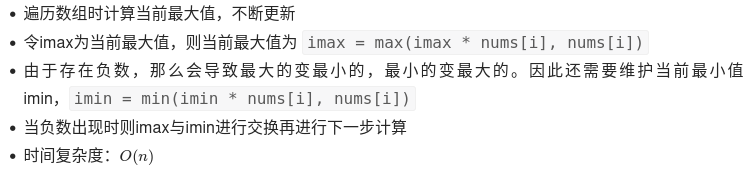

---
title:
date: 2022/8/23 下午6:01
tags: []
categories: []
---

# 动态规划



```python
def maxProduct(nums) -> int:
    ret, ma, mi = float("-inf"), 1, 1
    for num in nums:
        if num < 0:
            ma, mi = max(mi * num, num), min(ma * num, num)
        else:
            ma, mi = max(ma * num, num), min(mi * num, num)
        ret = max(ret, ma)
    return ret
```