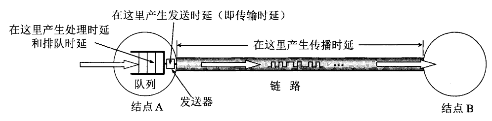

# 概述

## 21世纪的计算机网络

21世纪特征: 数字化，网络化， 信息化，是一个以网络为核心的时代。

网络包括: 电信网络，有线电视网络，计算机网络。
    
1. 电信网络: 提供电话，电报及传真服务；
2. 有线电视网络: 传送各种电视节目；
3. 计算机网络: 在计算机之间传送数据文件。

互联网(Internet)的基本特点: 连通性， 共享。

## 互联网概述

计算机网络(网络)由若干节点(node)和连接这些节点的链路(link)组成。**节点**可以是计算机，集线器，交换机或路由器等。

> 注: 习惯上，把与网络相连的计算机称为主机(host)。
> 注: internet泛指由多个计算机网络互连而成的计算机网络；Internet指当前全球最大的，开放的，由众多网络相互连接而成的特定互联网，它采用TCP/IP协议族作为通信的规则，且其前身是美国的ARPANET。

网络把许多计算机连接在一起，而互联网则把许多网络通过路由器连接在一起。

### ISP(Internet Service Provider)

**互联网服务提供者ISP**可分为主干ISP，地区ISP，本地ISP。

主干ISP(移动，联通)服务面积最大(国家级别)，拥有高速主干网，一些地区ISP可直接与主干ISP相连。
地区ISP是一些较小的ISP，地区ISP一般通过一个或多个主干ISP连接起来。
本地ISP(企业，大学)给用户提供直接的服务。本地ISP可以连接到地区ISP，也可以直接连接到主干ISP。

理论上讲，只要每一个本地ISP都安装路由器连接到某个地区ISP，每一个地区ISP也有路由器连接到主干ISP，在这些相互连接的ISP共同合作下，就可以完成互联网中的所有分组转发任务。
但随着互联网上数据流量的急剧增长，需要研究更快的转发分组，以及更有效地利用网络资源，提出**互联网交换点IXP(Internet eXchange Point)**。

### 互联网交换点IXP(Internet eXchange Point)

互联网交换点IXP的主要作用是允许两个网络直接相连并交换分组，不需要通过第三个网络来转发分组。

若两个地区ISP通过一个IXP连接起来，主机之间进行交换分组时，不必经过主干ISP，直接在两个地区ISP之间用高速链路对等的交换分组。使得互联网上的流量数据分布更加合理，同时减少了分组转发的延迟时间，降低了分组转发的费用。

典型的IXP由一个或多个网络交换机组成，许多ISP再连接到这些网络交换机的相关端口上。IXP常采用工作在**数据链路层**的数据交换机，这些网络交换机都哟格局与网互联起来。

### 互联网组成

互联网从工作方式看，可以划分为边缘部分及核心部分。

1. 边缘部分: 由所有连接在互联网上的主机组成。是用户直接使用的，用于通信和资源共享。

3. 核心部分: 由大量网络和连接这网络的路由器组成。为边缘部分提供服务，提供连通性和交换。

#### 边缘部分

   处于互联网边缘的部分，连接在互联网上的所有主机。又称为端系统(end system)。

   边缘部分利用核心部分提供的服务，使众多主机之间能够互相通信并交换或共享信息。

   更严格的说，主机A和主机B进行通信，应该表述为，运行在主机A上的某个程序和运行在主机B上的另一个程序进行通信，即，主机A的某个进程和主机B上的另一个进程通信。

   在网络边缘的端系统之间的通信方式通常划分为客户-服务器方式(C/S)和对等方式(P2P)。

1. 客户-服务器通信方式

    
    
    这是互联网上最常用，传统的方式。
    
    客户(client)和服务器(server)都是指通信中所涉及的两个应用进程。客户-服务器方式所描述的是进程之间服务和被服务的关系。
    
    主机A运行客户程序，主机B运行服务器程序。客户是服务请求方，服务器是服务提供方。
    
    客户A向服务器B发出服务请求，服务器B向客户A提供服务。二者都要使用网络核心部分所提供的服务。
    
    客户程序:

    a. 被用户调用后运行，在通信时主动向远地服务器发起通信(请求服务)。需要知道服务器程序的地址。
    
    b. 不需要特殊的硬件和很复杂的操作系统。

    服务器程序: 
    
    a. 专门用来提供某种服务的程序，可同时处理多个远地或本地客户的请求。
    
    b. 系统启动后即自动调用并一直不断的运行着，被动地等待并接受来自各地的客户的通信请求。不需要知道客户程序地址。

    c. 需要强大的硬件和高级的操作系统支持。

    在客户和服务器的通信建立后，通信是双向的，二者都可以发送和接收数据。

2. 对等连接方式

   
    
   两台主机在通信时并不区分哪一个是服务请求方，哪一个是服务提供方。只要两台主机都运行了对等连接软件，就可以进行平等，对等连接通信。这时，双方都可以下载对方已经存储在硬盘中的共享文档。

#### 核心部分

   网络核心部分是互联网中最复杂的部分，因为网络中的核心部分要向网络边缘中的大量主机提供连通性，使边缘部分中的任何一台主机都能够向其他主机通信。

   在网络核心部分起特殊作用的是**路由器**，它是一种专用计算机，是用于实现分组交换的关键构件，其任务是转发收到的分组，这是网络核心部分最重要的功能。
   
   > 电路交换
   > 必须经过**建立连接**(占用通信资源)，**通话**(一直占用通信资源)，**释放连接**(归还通信资源)三个步骤的交换方式。
   
   电路交换在通信过程一直占用通信资源，在用来传送计算机数据时，其线路的传输效率会很低。
   
   - 分组交换
   
   分组交换采用**存储转发**技术。
   
   通常把一个报文(message)划分成几个分组(packet, 首部(header) + 比报文小的等长数据段)后再进行传送。

   分组是在互联网中传送的数据单元。分组(packet)，又称包；首部(header)，又称包头。首部包含了诸如目的地址和源地址等重要控制信息，确保分组在互联网中独立地选择传输路径，并被正确的交付到分组传输的终点。

   > 路由器的分组交换
   > 
   > 路由器收到一个分组，先暂时存储一下，检查其首部，查找转发表(路由器记录)，按照首部中的目标地址，找到合适的接口转发出去，把分组交给下一个路由器。
   > 
   > 这样一步一步地以存储转发的方式，把分组交付给最终的目的主机。
   > 
   >  各路由器之间必须经常交换彼此掌握的路由信息，以便创建和动态维护路由器中转发表，使得转发表能够在整个网络拓扑发生变化时及时更新。 

   

   假定主机$H_1$向主机$H_5$发送数据。

   主机$H_1$先将分组逐个地发往与它直接相连的路由器$A$中。此时除链路$H_1 - A$外，其他通信链路并不被目前通信的双方所占用。
   即使是链路$H_1 - A$，也只是当分组正在此链路上传送时才被占用。在各分组传送之间的空闲时间，链路$H_1 - A$仍可为其他主机发送的分组使用。
   
   路由器A把主机$H_1$发来的分组放入缓存。假定从路由器$A$的转发表中查出应把该分组转发到链路$A - C$。于是把分组就转发到路由器$C$，再转发到路由器$E$，最终到主机$H_5$。
   若链路$A- C$的通信量太大，路由器$A$可以把分组沿另一个路由传送，即把分组转发到路由器$B$，再转发到路由器$E$，最终到主机$H_5$。
   
   分组转发在传送数据之前不必先占用一条端到端的链路的通信资源，同时省去了建立连接和释放连接的开销，因此数据的传输效率更高。

   采用存储转发的分组转发实际是采用了在数据通信的过程中断续/动态分配传输带宽的策略。

   为了提高分组交换的可靠性，互联网的核心部分常采用网络拓扑结构，使得当发生网络堵塞或少数节点，链路出现故障时，路由器可以灵活地改变转发路由器而不致引起通信的中断或全网瘫痪。
   此外，通信网络的主干线路往往由一些高速链路构成，这样就可以较高的数据率迅速地传送计算机数据。

   分组交换的优点：
      
   1. 高效: 在分组传输的过程中动态分配传输带宽，对通信链路是逐段占用。
   2. 灵活: 为每一个分组独立地选择最合适的转发路由。
   3. 迅速: 以分组为传送单位，可以不先建立链接就可以向其他主机发送分组。
   4. 可靠: 保证可靠性的网络协议；分布式多路由的分组交换网，使网络有很好的生存性。

   电路交换: 整个报文的比特流连续的从源点直达终点，好像在一个管道中传送。
   
   报文交换: 整个报文先传送到相邻接点，全部存储下来后查找转发表，转发到下一个节点。

   分组交换: 单个交换传送到相邻节点，存储下来后查找转发表，转发到下一个节点。

   
   
   若要连续传送大量的数据，且其传送时间远大于链接建立时间，则电路交换的传输速率较快。
   报文交换和分组交换不需要预先分配传输带宽，在传送突发数据时可提高整个网络的信道利用率。
   由于一个分组的长度往往远小于整个报文的长度，因此分组交换币报文交换的时延小，同时具有更好的灵活性。

### 计算机网络分类

   按照网络的作用范围进行分类:
   1. 广域网WAN(Wide Area Network): 是互联网的核心部分，通过长距离(跨国)运送主机所发送的数据。连接广域网各节点交换机的链路一般是高速链路，具有较大的通信容量。
   2. 城域网MAN(Metropolitan Area Network): 可跨越几个街区乃至整个城市。用于将多个局域网进行互连。目前很多城域网采用的是以太网技术。
   3. 局域网LAN(Local Area Network): 一般用微型计算机或工作站通过高速通信线路相连，地理局限范围小。
   4. 个人区域网PAN(Personal Area Network): 在10m左右的范围把属于个人的电子设备用无线技术连接起来的网络。

   按照网络的使用者进行分类:
   1. 公用网(public network): 所有按照愿意按电信公司的规定缴纳费用的人都可以使用这种网络。
   2. 专用网(private network): 某个部门为了满足本单位的特殊业务工作的需要而建造的网络。不向本单位以外的人提供服务。

### 计算机网络的性能指标

   1. 速率
   
      数据的传送速率，数据率(data rate)/比特率(bit rate)。

      一般提到网络的速率，指的是额定速率或标称速率，不是实际的网络运行速率。
   
   2. 带宽
   
      在频域中，衡量模拟信号时，带宽指某个信号具有的频带宽度，单位为赫兹，表示某信道允许通过的信号频带范围。
   
      在时域中，衡量数字信号时，带宽指在单位时间内网络中某信道所能通过的最高数据率，单位为比特每秒。表示网络中某通道传送数据的能力。
   
   3. 吞吐量(throughout)
   
      表示在单位时间内通过某个网络/信道/接口的实际的数据量。

      吞吐量是对实际网络数据量通过的衡量，受网络的带宽或网络的额定速率的限制。
   
   4. 各种时延

      时延(delay/latency)，又称延迟/迟延，指数据从网络的一端传送到另一端所需的时间。
   
      
   
      **发送时延**(transmission delay)，又称传输时延，是主机或路由器发送数据帧所需要的时间，即从发送数据帧的第一个比特算起，到该帧的最后一个比特发送完毕所需的时间。
      
      $$ 发送时延 = \frac{数据帧长度(bit)}{发送速率(bit/s)} $$
      
      发送时延并非固定不变，而是与发送的帧长成正比，与发送速率成反比。
   
      **传播时延**(propagation delay)是电磁波在信道中传播一定的距离需要花费的时间。
      
      $$ 传播时延 = \frac{信道长度(m)}{电磁波在信道上的传播速率(m/s)} $$

      传播时延与信号的发送速率无关，信号传送的距离越远，传播时延越大。
      
      **处理时延**即主机或路由器在收到分组时需要花费一定的时间进行处理。
      
      **排队时延**即分组在经过网络传输时，要经过许多路由器。分组在进入路由器后要先在输入队列中排队等待处理。路由器确定转发接口后，在输出队列中排队等待转发，产生排队时延。
      
      $$ 总时延 = 发送时延 + 传播时延 + 处理时延 + 排队时延 $$

   5. 时延带宽积
      
      $$ 时延带宽积 = 传播时延 \dot 带宽 $$
   
      以比特为单位的链路长度。

   6. 往返时间RTT
   
      RTT(Round-Trip Time)表示信息双向交互的时间。

   7. 利用率
   
      分为信道利用率和网络利用率。
      
      信道利用率指某信道有数据通过的时间；网络利用率指全网络的信道利用率的加权平均值。
      
      信道利用率不是越大越好，根据公式

      $$ D = \frac{D_0}{1 - U} $$

      信道或网络的利用率过高会产生非常大的时延。
      
      

### 计算机网络的非性能指标

   1. 费用
      
      一般，网络的速率越高，价格越高。

   2. 质量
    
      网络的质量取决于网络中所有构件的质量，以及这些构建是怎样组成网络的。

   3. 标准化
      
      网络的硬件和软件的设计即可以按照通用的国际标准，也可以遵循特定的专用网络标准。最好遵循国际标准，可以得到更好的互操作性，易于升级换代和维修，以及技术上的支持。
    
   4. 可靠性
    
      可靠性与网络的质量和性能密切相关。

   5. 可扩展性和可升级性
    
      网络的性能越高，其扩展费用往往也越高，难度也会相应增加。

   6. 易于管理和维护
     
      网络如果没有良好的管理和维护，就很难达到和保持所设计的性能。

## 计算机网络体系结构

   计算机网络的各层及其协议的集合就是网络的体系结构，即计算机网络机器狗和构建所应完成的功能。

   分层带来的优点:
      
   1. 各层之间是独立的：层级之间只需要知道该层通过层间的接口所提供的服务。
   2. 灵活性好：只要层间接口关系保持不变，层内部的改变不影响这层以上或以下各层。
   3. 结构上可分隔开。
   4. 易于实现和维护。
   5. 促进标准化工作：
      各层完成的功能可以是以下的任务的集合：
      1. 差错控制：使相应层次对等方的通信更加可靠。
      2. 流量控制：发送端的发送速率必须使接收端来得及接收，不要太快。
      3. 分段和重装：发送端将要发送的数据块划分为更小的单位，在接收端将其还原。
      4. 复用和分用 发送端几个高层会话复用一条底层的链接，在接收端再分用。
      5. 连接建立和释放：交换数据前先建立一条逻辑连接，数据传送结束后释放链接。
   
   网络协议用来实现在计算机网络中有条不紊的交换数据，明确规定了所交换数据的格式以及有关的同步问题。
   
   网络协议(network protocol)是为进行网络中的数据交换而建立的规则，标准或约定。
  
   网络协议包含三个要素：

   1. 语法：数据与控制信息的结构或格式。
   2. 语义：需要发出何种控制信息，完成何种动作以及做出何种相应。
   3. 同步：时间实现顺序的详细说明。

   
    
   目前，计算机体系结构中，TCP/IP的四层结构是常实现的结构，为了讲解清楚，采用OSI和TCP/IP的优点，讲解5层体系结构。

   1. 应用层(application layer)
    
      应用层是体系结构中的最高层。

      任务是通过应用进程之间的交互来完成特定网络应用。

      应用层协议定义的是应用进程之间通信和交互的规则。互联网中的应用层协议有: 域名系统DNS，支持万维网应用的HTTP等。

      应用层交互的数据单元称为报文。
   2. 运输层(transport layer)

      运输层的任务是负责向两台主机中进程之间提供通用的数据传输服务。应用进程利用该服务传送应用层报文。
      
      由于一台主机可同时运行多个进程，因此运输层有复用和分用的功能。

      > **复用**：多个应用层进程可同时使用下面的运输层服务。
      > 
      > **分用**：运输层把收到的信息分别交付给上面应用层的相应进程。
      
      运输层主要使用TCP协议和UDP协议。

      > **传输控制协议TCP**(Transmission Control Protocol)：提供面向连接，可靠的的数据传输服务，其数据传输的单位是报文段(segment)。
      > 
      > **用户数据报协议UDP**(User Datagram Protocol)：提供无连接，尽最大努力的数据传输服务。其数据传输的单位是用户数据报。
   
   3. 网络层(network layer)

      一个任务是为分组交换网上的不同主机提供通信服务，另一个任务是选择合适的路由，使源主机运输层所传下来的分组能够通过网络中的路由器找到目的主机。

      在发送数据时，网络层把运输层产生的报文段或用户数据包封装成分组或包进行传送。在TCP/IP体系中，由于网络层使用IP协议，因此分组/包也叫IP数据报，或简称数据报。

   4. 数据链路层/链路层(data link layer)

      两台主机之间的数据传输，总是在一段一段的链路上传送的，因此需要使用专门的链路层协议。

      在两个相邻节点之间传送数据时，数据链路层将网络层交下来的IP数据报**组装成帧**(framing)，在两个相邻节点间的链路上传送**帧**(frame)。

      每一帧包括数据和必要的控制信息。控制信息一是使得接收端在接收数据时能够知道一个帧从哪个比特开始和到那个比特结束，使得数据链路层在收到一个帧后从中提取数据部分上交给网络层。二是使得接收端能够检测到所收到的帧中是否有差错，若存在差错，数据链路层丢弃该帧，或者需要修正差错，需要使用可靠传输协议来纠错。
   5. 物理层(physical layer)

      在物理层上所传送的数据的单位是比特。物理层需要考虑用多大的电压代表二进制位，以及接收方如何识别发送方所发送的比特，还需要确认连接电缆的插头应当有多少根引脚以及各引脚应如何连接。

   

   假定两台主机通过一台路由器连接起来，主机1的应用进程$ AP_1 $向主机2的应用进程$ AP_2 $传送数据。说明应用进程的数据在各层之间传递过程中经历的变化。

   1. $ AP_1 $先将数据交给本主机的应用层。
   2. 应用层加上必要的控制信息$ H_5 $就变成了下一层的数据单元。
   3. 运输层收到这个数据单元后，加上本层的控制信息$ H_4 $就变成了下一层的数据单元。
   4. 网络层收到这个数据单元后，加上本层的控制信息$ H_3 $就变成了下一层的数据单元。
   5. 数据链路收到这个数据单元后，本层控制信息分为头部$ H_2 $和尾部$ T_2 $进行添加就变成了下一层的数据单元。
   6. 物理层收到这个数据单元后，以比特进行传送。
   7. 比特流离开主机1网络的物理媒体传送到路由器时，就从路由器的第一层依次上升到第三层，每一层都根据控制信息进行必要的操作，将控制信息剥去，该层剩下的数据单元上交给更高一层。
   8. 当分组上升到第3层时，根据首部中的目的地址查找路由器中的转发表，找出转发分组的接口，往下传送到第2层，加上新的首部和尾部控制信息后。再到最下面第1层，接着在物理媒体上把每一个比特发送出去。
   9. 比特流离开路由器到达目的站主机2时，就从主机2的的第1层依次上升到最高层第5层。
   10. 最后，应用进程$ AP_1 $发送的数据交给目的站的应用程序$ AP_2 $。

   
