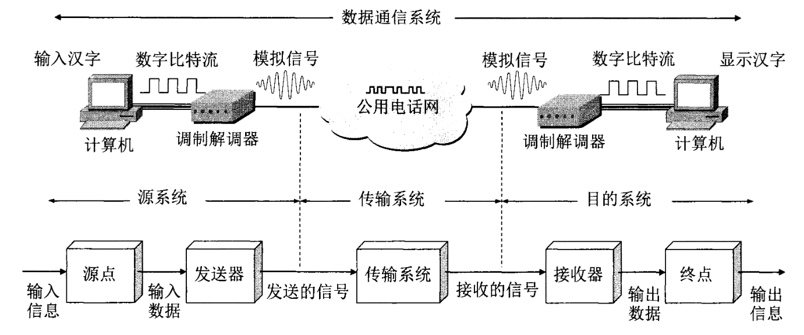

# 物理层

物理层考虑的是怎样才能在连接各种计算机的传输媒体上传输数据比特流。需要尽可能屏蔽计算机网络中的硬件设备和传输媒体以及通信手段的不同，使得物理层上面的数据链路层感觉不到这些差异，让数据链路层只需要考虑如何完成本层的协议和服务，不必考虑网络具体的传输媒体和通信手段。

物理层**规程**(procedure)指物理层的协议。

物理层的主要任务是确定与传输媒体的借口有关的一些特性：
1. 机械特性: 指明接口所用接线器的形状和尺寸，引脚数目和排列，固定和锁定装置等。
2. 电气特性: 指明在接口电缆的各条线上出现的电压的范围。
3. 功能特性: 指明某条线上出现的某一点评的电压的意义。
4. 过程特性: 指明对于不同功能的各种可能事件的出现顺序。

## 数据通信系统的模型

   数据通信系统可划分为三部分: 源系统/发送端/发送方，传输系统/传输网络，目的系统/接收端/接收方。

   

   1. 源系统

      源系统一般包括两个部分，**源点/源站/信源**(source)和**发送器**。

      - 源点: 源点设备产生要传输的数据。
      - 发送器: 通常源点生成的数字比特流要通过发送器编码后才能够在传输系统中进行传输。
   2. 目的系统
      目的系统一般包括两个部分，**接收器**和**终点/目的站/信宿**(destination)。

      - 接收器: 接收传输系统传送过来的信号，并把它转换为能够被目的设备处理的信息。
      - 终点: 终点设备从接收器获取传送来的数字比特流，把信息输出。
   
   在源系统和目的系统之间的传输系统可以是简单的传输线，也可以是连接在源系统和目标系统之间的复杂网络系统。
   
> 通信的目的是传送**消息**(message)。
> 
> **数据**(data)是运送消息的实体。其严格定义为是使用特定方式表示的信息，通常是有异议的符号序列。
> 
> **信号**(signal)则是数据的电气或电磁的表现。
   
信号可分为**模拟信号**和**数字信号**:
1. 模拟信号/连续信号: 消息参数的取值是连续的。
2. 数字信号/离散信号: 消息参数的取值是离散的。代表不同离散数值的基本波形成为**码元**。

> **信道**(channel)一般用来表示向某一个方向传送信息的媒体。

从通信的双方信息交互的方式来看，有三种基本方式: **单向通信/单工通信**，**双向交替通信/半双工通信**和**双向同时通信/全双工通信**。
1. 单向通信: 只能有一个方向的通信而没有反方向的交互，eg: 无线广播，电视。
2. 双向交替通信: 通信的双方都可以发送信息，但不能双方同时发送/同时接收。这种通信方式是一方发送另一方接收，过一段时间后反向工作。
3. 双向同时通信: 通信的双方可以同时发送和接收信息。

> 来自信源的信号称为基带信号(基本频带信号)。

   

   